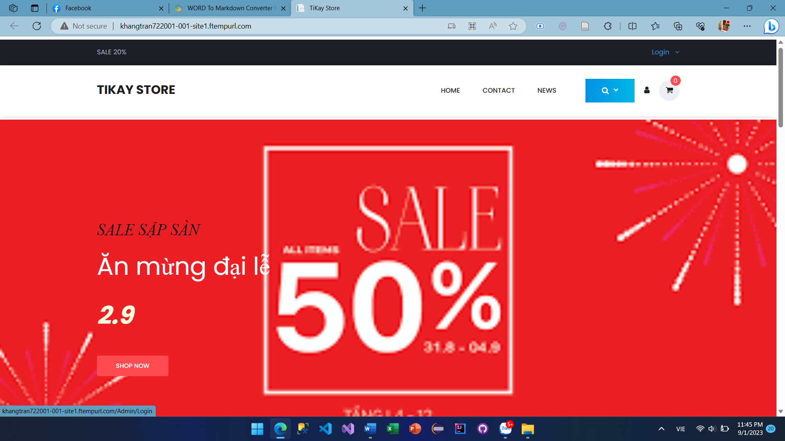

> TỔNG LIÊN ĐOÀN LAO ĐỘNG VIỆT NAM
>
> **TRƯỜNG ĐẠI HỌC TÔN ĐỨC THẮNG**
>
> **KHOA CÔNG NGHỆ THÔNG TIN**

{width="1.626865704286964in"
height="0.9006638232720909in"}

**TRẦN NGUYÊN KHANG - 51900112**

**NGUYỄN HOÀNG HUY TÂM - 51900205**

> **XÂY DỰNG WEBSITE CHO**
>
> **CỬA HÀNG BÁN LẺ THIẾT BỊ**
>
> **DI ĐỘNG TIKAY STORE CÓ**
>
> **HỖ TRỢ KHUYẾN NGHỊ**
>
> **DỰ ÁN CÔNG NGHỆ THÔNG TIN 2**

**KỸ THUẬT PHẦN MỀM**

Người hướng dẫn

**TS. Trần Thanh Phước**

> **THÀNH PHỐ HỒ CHÍ MINH, NĂM 2023**

# Giới thiệu đề tài

Website cho cửa hàng bán lẻ thiết bị di động Tikay Store được tạo ra
nhằm mang đến sự thuận tiện khi mua hàng trực tuyến cho khách hàng có
nhu cầu tìm hiểu và mua các thiết bị di động như điện thoại, iPad,
laptop,... với đầy đủ các thông tin rõ ràng, minh bạch và dễ dàng sử
dụng. Ngoài ra website còn tích hợp hệ thống khuyến nghị để giúp người
dùng có thêm nhiều sự lựa chọn mua hàng dựa vào những gợi ý đi kèm với
sản phẩm, cho phép người dùng có thể tự do mua hàng và bổ sung thêm
những món hàng cần thiết đi kèm.

# Nội dung đĩa CD

Đĩa CD chứa các nội dung sau:

-   Thư mục Pdf: chứa file báo cáo dưới dạng pdf.

-   Thư mục word: chứa file báo cáo dưới dạng word.

-   Thư mục Resources:

    -   Thư mục File database: chứa file Database.

    -   Thư mục sơ đồ hoạt động: chứa 38 hình ảnh sơ đồ hoạt động.

    -   Thư mục sơ đồ usecase: chứa hình ảnh sơ đồ usecase.

    -   Thư mục sơ đồ tuần tự: chứ 38 hình ảnh sơ đồ tuần tự.

-   Thư mục Source: chứ tất cả code và thư viện của dự án.

# Hướng dẫn sử dụng

## Truy cập vào đường dẫn 

Đường dẫn :
[http://khangtran722001-001-site1.ftempurl.com/\'](http://khangtran722001-001-site1.ftempurl.com/)

## Visual Studio và SQL Server

1.  Import file datebase vào SQL Server. File được tên "database.bak"
    tại thư mục Resources/ File Database.

2.  Mở file "TiKayStore.sln" tại thư mục
    Source\\TiKay-Store-main\\TiKayStore.

3.  Thực hiện kết nối database tại SQL Server vào dự án tại Visual
    Studio.

4.  Thực thi dự án.

# Hướng dẫn truy cập trang quản lý

Để truy cập vào trang quản lý , chọn "Login" như hình 1. Sau đó đăng
nhập bằng tài khoản tại bảng 1.

{width="6.102083333333334in"
height="3.432638888888889in"}

Hình . Hướng dẫn truy cập trang quản lý.

  -------------------------------------------------------------------------
  **STT**    **Email**                     **Mật khẩu**     **Chức vụ**
  ---------- ----------------------------- ---------------- ---------------
  1          <khangtran722001@gmail.com>   123456           Quản lý

  2          <nhhtam212001@gmail.com>      111111           Nhân viên
  -------------------------------------------------------------------------

Bảng . Danh sách tài khoản quản lý.

Tùy thuộc vào chức vụ mà sẽ có quyèn truy cập vào các chức năng nhất
định. Đối với quản lý thì có thể truy cập tất các chức năng, còn nhân
viên thì chỉ truy cập các chức năng được quản lý cấp quyền.
